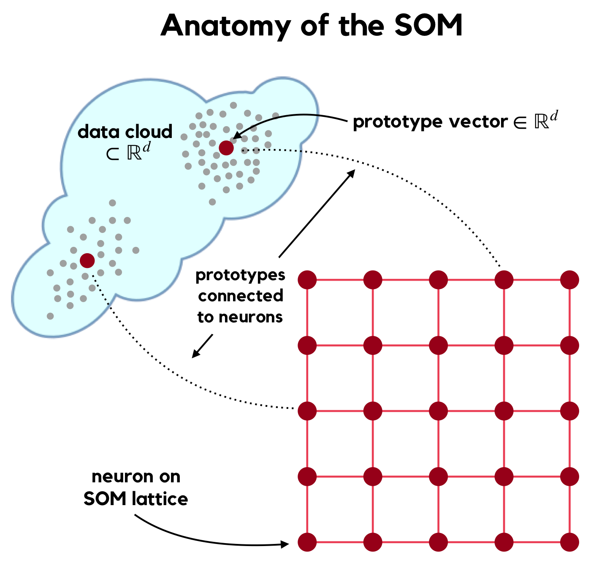

Background
==========

Kohonen’s SOM
-------------

Kohonen’s Self-Organizing Map (SOM, \[@Kohonen2001\]) is an unsupervised
neural network for high-dimensional manifold learning and
low-dimensional representation of this learning. During training a
pre-defined number of **prototype** vectors
*W* = {*w**j* ∈ ℝ*d*}*j* = 1*n**W*,
 are formed to best represent given training data
*X* = {*x**s* ∈ ℝ*d*}*s* = 1*n**X*
 which are assumed to be sampled from an (unknown) manifold ℳ. Each
prototype vector *w**j* is associated with a **neuron**
*ν**j*, which is an element of the SOM’s **output space** ℒ
(usually a lattice topology in ℝ2 or possibly ℝ3,
SOMDisco exclusively uses 2-d lattices). As the prototype vectors are
formed the neurons are simultaneously **organized** on ℒ such that they
are **topology preserving** – that is, neighboring prototypes in
ℝ*d* are associated with neurons neighboring neurons on ℒ.
Salient features of ℳ are then faithfully represented on ℒ, allowing an
analyst to infer high-dimensional data characteristics (such as, e.g.,
cluster structure) from their lattice representation.

This organization is enforced by cooperative updates to the prototypes
during the learning process. At training step *t*, prototype updates are
governed by
*w**j**t* = *w**j**t* − 1 + *α**t* × *η*(*j*, *j**t*\* | *σ**t*) × (*x**t* − *w**j*)
 where

-   *α**t* is a learning parameter controlling the amount by
    which prototypes are allowed to change at step *t*, which should be
    annealed over time
-   *x**t* ∈ *X* is a training vector chosen at random for
    presentation to the network at time *t*, also called the network
    **stimulus** at time *t*
-   *η* (the **neighborhood function**) is a non-increasing function of
    the lattice distance between neurons *ν**j* and
    *ν**j**t*\*, where
    *j**t*\* indexes the prototype closest to the
    datum *x**t*. We call this the **Best Matching Unit** of
    *x**t*:
    *B**M**U*(*x**t*) := *j**t*\* = arg min*j* *d**E*(*w**j*, *x**t*)
     where *d**E* is standard Euclidean distance.  
-   *σ**t* is a learning parameter controlling the size of a
    lattice neighborhood centered about neuron
    *ν**j**t*\*; neurons residing in
    this neighborhood are affected more strongly by the stimulus
    *x**t*, with affect inversely proportional to their
    lattice distance to the BMU.

The implication of including the composition of several notions of
distance (i.e., in both ℝ*d* and ℒ) in the prototype update
rule forms a highly non-linear mapping *Φ* : ℳ → ℒ. *Φ* is
**self-organized**, meaning the relationship between neuron proimities
on ℒ and prototype proximities in ℳ arises organically, without direct
optimization of any loss function. SOM Learning is modeled after the
organization and compartmentalization of the learning process which
occurs in the human brain.

Conscience SOM
--------------

Kohonen’s prototype updates can yield a mapping *Φ* which under-utilizes
the quantizer’s full codebook (i.e., the set of prototypes *W*). Such
under-utilizations degrade the richess of the representation of ℳ by 𝒲
(and on ℒ). To correct this, DeSieno introduced the **Conscience SOM**
(or **CSOM**, \[@DeSieno1988\]), which introduces a **bias** to
Kohonen’s algorithm to achieve a mapping *Φ* with higher entropy. Each
prototype possesses its own bias *b**j**t* which
influences the competitive stage of SOM learning such that CSOM BMU
selection at time *t* becomes
*B**M**U*(*x**t*) = arg min*j* *d**E*(*w**j*, *x**t*) − *b**j**t*.
 The biases {*b**j*} are formed alongside the prototype
vectors during learning via the use of auxiliary quantities
{*p**j*} representing the historical **win frequencies** of
each prototype (i.e, proportion of times a prototype has quantized data
during learning). These win frequencies are updated during each learning
step by
*p**j**t* = *p**j**t* − 1 + *β**t* × (𝟙\[*j* = *j**t*\*\] − *p**j**t* − 1)
 yielding a bias
$$ b\_j^t = \\gamma\_t \\times \\left( \\frac{1}{n\_W} - p\_j^t \\right) $$
 For maximum-entropy mapping, *p**j* = 1/*n**W*
implying zero bias. The additional learning parameters *β**t*
and *γ**t* control the degree to which the SOM’s “Conscience”
influences its learning. Like the learning rate *α**t* they
should both be annealed over time.

A properly trained CSOM can achieve more effective utilization of the
SOM’s output space \[@DeSieno1988\] which aides (cluster) inference from
a trained map. In contrast to Kohonen’s cooperative function (*η*),
DeSieno also suggested restricting prototype updates to a very small
neighborhood of neurons (e.g., *σ**t* = 1), which decreases
the computational burden of CSOM learning (as compared to Kohonen’s
SOM). Moreover, as all prototypes are encouraged to participate in the
learned representation of ℳ the resulting view of the manifold is often
richer, providing for more sophisticated cluster extraction tools such
as the CADJ matrix.

The CADJ Matrix
---------------

**CADJ** (or **C**umulative **ADJ**acency, \[@TasdemirMerenyi2009\]) is
a weighted adjacency matrix of SOM prototypes (or, equivalently, their
associated neurons). The edge weights of this **Topology Representing
Network** \[@MartinetzSchulten1994\] are given by
*C**A**D**J**i**j* = \#{*x**s* : *B**M**U*1(*x**s*) = *i* and *B**M**U*2(*x**s*) = *j*}
 where BMU1 and BMU2 are the first and second-ranking BMU, respectively.
Analysis of the CADJ values reveals the “seams” (disconnects) of a
learned manifold, which are helpful for discerning cluster structure.

While CADJ can technically be computed using the codebook of *any*
vector quantizer as vertices, the SOM’s output space ℒ provides prime
real estate on which to view and analyze this graph, regardless of data
dimension *d*. The **CONNvis** visiualization \[@TasdemirMerenyi2009\],
derived from the symmetrized **CONN**ectivity graph,
*C**O**N**N* = *C**A**D**J* + *C**A**D**J**T*,
 has been used repeatedly to elicit cluster structure from complex,
high-dimensional manifolds with **no restriction** on cluster size
(number of data members), shape (e.g., Gaussianinity), or dimension
(low-rank embeddings). These settings are precisely where performance of
other clustering routines (e.g., hierarchical methods, k-means, mixture
models) deterioriate.

Despite the demonstrated benefits and sophistication of the combination
of CSOM manifold learning and subsequent CADJ-based cluster extraction
(CITE), neither of these tools are currently publicly available to the
machine learning community. SOMDisco rectifies this omission.
